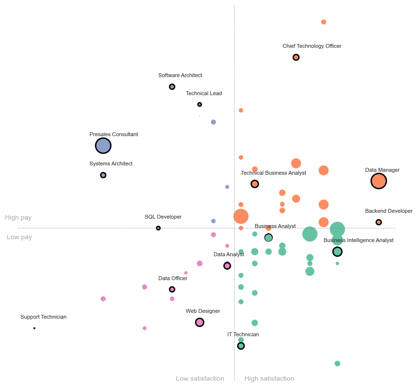

# Web-Scrapping

In this project, I use Selenium and an API to scrape data about job market statistics and job postings from seek.com.au.

***Selenium***: To automate the process of gathering list of industries from the Seek website, which can be useful for further analysis or fed into subsequent functions for data extraction.

***API*** The API is reverse-engineered, meaning the endpoint and the required parameters were identified through inspecting network traffic while using the seek.com.au website. This allows for automated extraction of job listing data directly from the website's backend.

***Concurrent Processing***To improve the processing speed and efficiency of the scraping process, I utilize concurrent.futures in the script. This enables the script to fetch job data for multiple pages concurrently, significantly reducing the time required to collect data. By executing multiple requests in parallel, the script can handle a higher volume of data in a shorter amount of time compared to sequential requests.

***Exploratory Data Analysis*** Once the data is extracted, it is cleaned and explored to ensure accuracy and completeness. The cleaned data is then used to create visualizations that provide users with a better understanding of the job market in Australia. For example, visualisations might include:

These visualisations help to provide insights into the job market, such as identifying high-demand job roles, understanding salary distributions. This information can be valuable for job seekers, employers, and researchers interested in the dynamics of the Australian job market.
